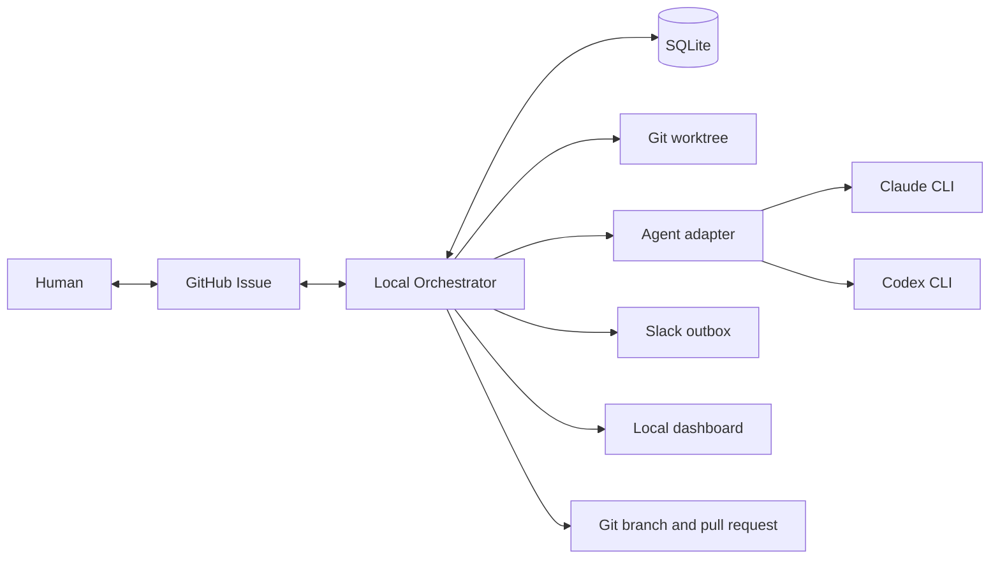
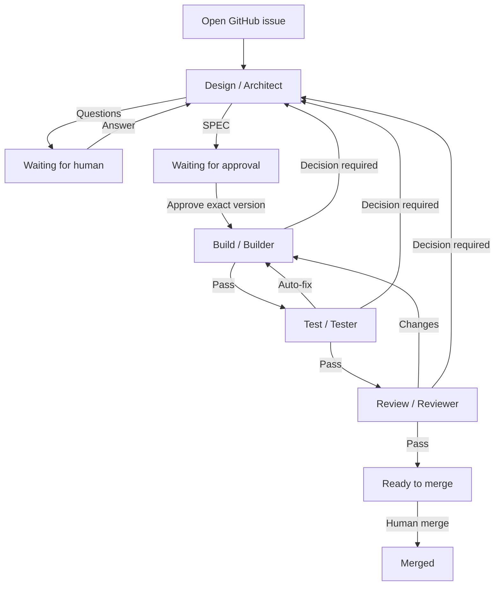

# AI Factory — Context and Workflow Evolution Specification

**Status:** Draft for design review  
**Date:** 2026-09-19  
**Audience:** Product and architecture reviewers, AI agents, and future implementers  
**Scope:** Agent context management, workflow state, audit events, and GitHub issue projection  
**Implementation status:** This document describes the current system and a candidate evolution. The proposal is not implemented or approved yet.

## 1. Purpose of this document

This specification explains:

1. What AI Factory does and what outcome it is intended to produce.
2. How the current implementation coordinates agents, state, persistence, GitHub, and local execution.
3. Why the current context and workflow models are becoming difficult to reason about.
4. A proposed architecture that preserves decision history, gives each agent the context it needs, reduces unnecessary token use, and makes issue state understandable to humans.

The document is deliberately self-contained so it can be given to other agents for critique. Reviewers should distinguish statements about the **current implementation** from the **candidate proposal**.

## 2. System purpose and objective

AI Factory is a locally executed software-delivery orchestrator. It turns a GitHub Issue into a versioned specification, an implementation in an isolated Git worktree, independent verification, an independent delivery review, and finally a pull request for human merge.

The system coordinates four roles:

| Role | Short name | Stage | Responsibility |
| --- | --- | --- | --- |
| Product Architect | Architect | Design | Clarifies the request, produces the specification, and resolves tactical decisions. |
| Implementation Engineer | Builder | Build | Implements the approved specification. |
| Verification Engineer | Tester | Test | Independently verifies the approved acceptance criteria. |
| Delivery Reviewer | Reviewer | Review | Reviews compliance, quality, security, performance, tests, dependencies, and product consistency. |

Each role can use Claude or Codex with a configured model or provider-managed automatic model selection. The orchestrator, rather than an agent, controls role routing, approvals, state transitions, retries, commits, branch publication, and pull-request creation.

### 2.1 Intended outcome

For each accepted issue, AI Factory should produce:

- A clear and approved specification with stable acceptance criteria.
- A traceable record of human and tactical decisions.
- An implementation isolated from other work.
- Evidence that every approved criterion was tested.
- An independent review of the final delivery.
- A pull request that a human can inspect and merge.
- An audit trail explaining what happened, why it happened, and what action is required when work stops.

### 2.2 Core authority model

- The human owns material product, architecture, scope, risk, and merge decisions.
- Architect may resolve tactical choices that remain within an approved specification.
- Builder, Tester, and Reviewer may identify decisions, but do not silently change the approved contract.
- SQLite is authoritative for execution and workflow state.
- GitHub is the human collaboration surface and a readable projection of factory state.
- Slack is a notification channel. It is not an authority or decision surface.

### 2.3 Operational boundary

The current factory executes locally on macOS, manages one target repository per installation, and runs agent stages sequentially. Agent invocations are fresh and independent. The provider conversation is not the durable memory of the system.

## 3. Current architecture

### 3.1 Component model



The principal components are:

- **Orchestrator:** deterministic TypeScript daemon that polls GitHub, invokes roles, validates structured results, changes workflow state, and publishes human-readable messages.
- **SQLite store:** persists work items, serialized context, executions, events, specifications, controls, GitHub comment outbox, and Slack notification outbox.
- **Execution manager:** creates a run record, supervises provider processes, captures output and token usage, enforces timeouts, and recovers interrupted runs.
- **Worktree manager:** creates one branch and Git worktree per issue, validates role mutation boundaries, commits accepted changes, and publishes the final branch.
- **Provider adapters:** translate the common role request into Claude CLI or Codex CLI arguments and parse structured output.
- **GitHub adapter:** reads issues/comments, updates labels and a progress comment, publishes milestone/report comments, and creates or reconciles pull requests.
- **Dashboard:** displays services, issues, workflow state, executions, token/time metrics, configuration, credentials, events, and logs.

### 3.2 Current workflow



The current persisted `WorkState` values are:

```text
NEW
SPEC
WAITING_HUMAN
DEVELOPMENT
QA
REVIEW
READY_TO_MERGE
MERGED
PR_CLOSED
PAUSED
FAILED
CANCELLED
```

These values combine delivery stages, blocking conditions, operator controls, failure states, and pull-request lifecycle states.

### 3.3 Current work-item context

Most current workflow memory is serialized into one `Context` JSON object on the `work_items` row. It contains:

- Issue title, body, URL, and GitHub comment cursor.
- Current SPEC version, markdown, criteria, complexity/risk assessment, approval, and draft.
- Accumulated decisions.
- Latest report by role.
- A string array named `feedback`.
- Correction cycle count.
- Waiting reason.
- Consultation return stage.
- Retry guidance.
- Failure and interrupted-stage metadata.
- Worktree path, pull request, and merge metadata.

This object is both:

- The current workflow projection.
- A source for future prompts.
- A partial artifact store.
- A recovery checkpoint.

Full historical executions and events also exist in separate SQLite tables, while immutable SPEC snapshots live in `specs`.

### 3.4 Current agent context construction

Every provider invocation starts fresh. Claude explicitly disables session persistence. Durable continuity therefore depends on the prompt assembled by AI Factory and the files present in the worktree.

The prompt currently combines:

1. The role contract.
2. Provider-specific instructions.
3. A report template when applicable.
4. Common structured-output and runtime rules.
5. Current issue, SPEC, criteria, assessment, decisions, approval, and consultation.
6. Role-specific evidence.
7. Feedback selected from the shared `feedback` array.
8. Human retry guidance as a final mandatory instruction.
9. The complete implementation diff for Reviewer.

The current role differences are:

| Role | Current additional context |
| --- | --- |
| Architect | Current consultation, Architect draft, shared feedback, issue and approved artifacts. |
| Builder | Approved artifacts, decisions, shared feedback, retry guidance, and repository files. |
| Tester | Approved artifacts and decisions; shared feedback is deliberately omitted to preserve independence. |
| Reviewer | Approved artifacts, implementation diff, and attributed Tester execution evidence; shared feedback is omitted. |

To limit recent prompt growth, feedback is currently reduced to the latest 20 entries, each entry is bounded, and the selected feedback is limited to approximately 24 KB. Legacy serialized reports are converted into shorter summaries, findings, and decisions when possible.

### 3.5 Current result and routing model

Agents return a structured `AgentResult` containing an outcome, summary, findings, decisions, coverage, tests, dependencies, and changed files.

Architect outcomes:

- `spec`
- `questions`
- `resolved`

Delivery outcomes:

- `pass`
- `changes`
- `decision`

Findings are classified as:

- `auto-fix`
- `decision-required`
- `defer`

The orchestrator validates these combinations and routes them deterministically. For example, `changes` requires an `auto-fix` finding, and `decision` requires a `decision-required` finding.

### 3.6 Current GitHub projection

GitHub currently receives:

- Factory-managed workflow labels.
- One updatable progress comment.
- Immutable comments for start, questions, SPEC approval, reports, tactical resolutions, correction limit, failures, pause/cancel/recovery, ready-to-merge, PR closure, and merge.
- CTA sections with the exact command required from the human.

The issue remains open during delivery. The pull request closes it after merge through GitHub's normal closing reference.

### 3.7 Current audit model

The `events` table stores timestamped event type and JSON payload records. Examples include:

- `state.changed`
- `model.selected`
- `agent.result`
- `execution.started`
- `execution.finished`
- `spec.approved`
- `decision.tactical`
- `workflow.error`
- GitHub synchronization and control events

These events support the dashboard and troubleshooting. They are append-only in practice, but are not yet a formal, versioned domain-event contract from which the complete work-item state is rebuilt.

## 4. Current problems

### 4.1 Context fidelity and continuity

### Problem C1 — One object has too many responsibilities

`Context` mixes canonical business facts, transient execution state, recovery checkpoints, latest reports, human guidance, and prompt memory. A mutation intended for one concern can accidentally damage another concern.

An observed example was a follow-up Architect question clearing both the approved SPEC reference and the tactical consultation return route. The later Architect response was valid, but the orchestrator could no longer determine where it belonged.

### Problem C2 — Decision history lacks lifecycle metadata

The current decision array records decision text and rationale, but does not fully model:

- Stable decision ID.
- Source comment or execution.
- Author/actor.
- SPEC version.
- Scope.
- Status such as active, superseded, or revoked.
- The decision that superseded it.

As a result, later agents can receive decisions without a reliable way to understand precedence or continued validity.

### Problem C3 — Human guidance has ambiguous scope

The system distinguishes answers and retry guidance operationally, but does not model whether an instruction applies to:

- One attempt.
- One workflow stage.
- The rest of the current delivery.
- One SPEC version.
- The entire issue until explicitly replaced.

For example, “do not use Chromium” may need to affect every remaining agent, while “rerun this command” may be relevant only to the next attempt.

### Problem C4 — Feedback is chronological rather than task-aware

The recent feedback bound prevents unlimited growth, but relevance is still inferred from recency and string parsing. Important old decisions can be dropped while recent but already resolved material remains.

### Problem C5 — Historical reports are duplicated or overwritten

The latest report for each role is stored in `context.reports`, while full historical reports survive in `events`. Prompt construction reads the projection, not a purpose-built artifact ledger. Recovery and analysis sometimes need to infer intent from previous events or remaining reports.

### Problem C6 — Prompt provenance is incomplete

The system records model selection and token totals, but does not retain a manifest of the exact context records included in an execution. After a poor decision, it is difficult to answer:

- Did the agent receive the relevant human instruction?
- Which decision version did it see?
- Was an important finding excluded by context compaction?
- Which prompt section consumed most of the input budget?

### Problem C7 — Token control is coarse

The 24 KB feedback cap addresses one source of growth, but other large inputs remain, including the complete Reviewer diff, issue body, SPEC, reports, and repeated static instructions. There is no role-specific token budget or section-level usage estimate.

### Problem C8 — Ordinary issue comments have weak semantics

Recognized commands are processed. Comments posted during noninteractive stages are observed and the cursor advances, but their content is not automatically added to agent context. This is safe against accidental instructions, but can surprise users who expect any new owner comment to influence the workflow.

### 4.2 Workflow and issue-state problems

### Problem W1 — State conflates independent dimensions

`SPEC`, `DEVELOPMENT`, `QA`, and `REVIEW` are stages. `WAITING_HUMAN` and `FAILED` are conditions. `PAUSED` and `CANCELLED` are controls. `READY_TO_MERGE`, `PR_CLOSED`, and `MERGED` represent delivery lifecycle.

Combining them into one enum requires auxiliary fields such as `resume`, `waiting`, `consultation.from`, and `pendingStage` to reconstruct the actual position.

### Problem W2 — Failure hides the stage

When a Build execution fails, the visible state becomes `FAILED`. The original stage must be recovered from another field. This complicates retry and makes status less informative.

### Problem W3 — Waiting reasons are encoded indirectly

The same `WAITING_HUMAN` state can mean:

- Clarification required.
- SPEC approval required.
- Correction limit reached.

The actual meaning lives in `context.waiting`, and the valid response command depends on that hidden subtype.

### Problem W4 — Tactical routing is stored as transient state

Architect consultations depend on `consultation.from`. Losing that single field can invalidate an otherwise correct result. The return route should be a durable request/decision artifact rather than incidental mutable context.

### Problem W5 — Events are descriptive but not a complete domain protocol

`state.changed` records `from` and `to`, while related reason, actor, run, control, comment, and result may be separate events. Consumers must correlate them by timing and work-item ID. There is no schema version or guaranteed payload by event type.

### Problem W6 — GitHub can become noisy or ambiguous

The progress comment is useful, but immutable comments also publish many workflow reports and recovery messages. A user can see several old CTAs and failure messages while only the newest state is actionable.

### Problem W7 — Labels cannot represent stage and condition independently

A single state label can communicate failure or waiting, but then loses Build/Test/Review position. Conversely, a stage label cannot communicate that human attention is required.

### Problem W8 — Business blockers and technical failures are conflated

A provider process failure, invalid structured result, missing credential, human decision, failed acceptance criterion, and exhausted correction loop have different owners and recovery actions. They should not all appear as equivalent workflow failure.

## 5. Goals and non-goals of the proposed evolution

### 5.1 Goals

- Give every role the minimum complete context needed for a good decision.
- Preserve human instructions and decisions with explicit provenance and lifecycle.
- Preserve Tester and Reviewer independence where required.
- Bound prompt size using relevance and priority rather than truncation alone.
- Make every execution's input context auditable.
- Separate workflow stage, runtime status, and blocking reason.
- Make retry resume the current stage without inference.
- Make GitHub clearly show current status and durable human-relevant history.
- Preserve deterministic orchestration and explicit human authority.
- Support migration of existing SQLite work items without replaying completed work.

### 5.2 Non-goals

- Replacing deterministic routing with an AI orchestrator.
- Persisting provider chat sessions as the source of truth.
- Sending full logs or private prompts to GitHub.
- Automatically merging pull requests.
- Supporting multiple repositories in one daemon as part of this change.
- Replaying the entire event stream on every daemon tick.
- Treating an AI-generated summary as authoritative over structured decisions or human instructions.

## 6. Proposed context architecture

### 6.1 Separate canonical records from projections

Replace the prompt-memory responsibilities of the monolithic context with structured ledgers. The current work-item row may retain a compact projection for fast reads, but canonical artifacts should have stable IDs and explicit types.

Candidate records:

```ts
interface DecisionRecord {
  id: string;
  workItemId: string;
  specVersion: number;
  kind: "human" | "tactical" | "scope" | "architecture" | "risk";
  decision: string;
  rationale: string;
  source: { type: "github-comment" | "agent-result"; id: string };
  actor: { type: "human" | "architect"; name: string };
  scope: "attempt" | "stage" | "delivery" | "spec" | "issue";
  status: "active" | "superseded" | "revoked";
  supersededBy?: string;
  createdAt: string;
}

interface InstructionRecord {
  id: string;
  workItemId: string;
  text: string;
  sourceCommentId: number;
  author: string;
  scope: "next-attempt" | "stage" | "delivery" | "spec" | "issue";
  appliesToRoles: AgentRole[];
  status: "active" | "consumed" | "superseded" | "revoked";
  createdAt: string;
}

interface FindingRecord {
  id: string;
  workItemId: string;
  specVersion: number;
  criterionId?: string;
  originRole: AgentRole;
  classification: "auto-fix" | "decision-required" | "defer";
  evidence: string;
  status: "open" | "resolved" | "accepted-defer" | "superseded";
  resolvedByExecutionId?: string;
}

interface HandoffRecord {
  id: string;
  workItemId: string;
  specVersion: number;
  fromRole: AgentRole;
  toStage: WorkflowStage;
  summary: string;
  changedFiles: string[];
  openFindingIds: string[];
  evidenceExecutionId: string;
}
```

Structured records remain authoritative. Summaries help agents navigate them but cannot silently replace or contradict them.

### 6.2 Build a Context Pack for every execution

The orchestrator should create a versioned `ContextPack` before invoking a provider.

```ts
interface ContextPackManifest {
  version: number;
  workItemId: string;
  executionId: string;
  role: AgentRole;
  specVersion: number;
  includedDecisionIds: string[];
  includedInstructionIds: string[];
  includedFindingIds: string[];
  includedHandoffIds: string[];
  sectionSizes: Record<string, number>;
  estimatedInputTokens: number;
  hash: string;
}
```

Context selection should be deterministic:

1. Include the current approved SPEC and all criteria.
2. Include all active human decisions and instructions applicable to the role.
3. Include all open blocking findings applicable to the stage.
4. Include the current consultation or handoff.
5. Include role-specific evidence.
6. Include bounded recent historical evidence only when relevant.
7. Exclude resolved, superseded, or unrelated history.

No required record may be dropped merely because optional history consumed the budget.

### 6.3 Role-specific Context Packs

| Context section | Architect | Builder | Tester | Reviewer |
| --- | ---: | ---: | ---: | ---: |
| Issue request | Yes | Summary | Summary | Summary |
| Approved SPEC and criteria | Yes | Yes | Yes | Yes |
| Active human decisions | Yes | Yes | Yes | Yes |
| Active tactical decisions | Yes | Yes | Yes | Yes |
| Applicable human instructions | Yes | Yes | Yes | Yes |
| Open decision request | Yes | If origin | If origin | If origin |
| Open auto-fix findings | Relevant | Yes | IDs/status | IDs/status |
| Builder narrative | Only if relevant | Latest handoff | No | No |
| Changed-file manifest | Relevant | Yes | Yes | Yes |
| Full implementation diff | On demand | On demand | On demand | Yes, bounded/chunked |
| Tester execution evidence | If blocker | No | Own work | Yes, attributed |
| Historical resolved reports | No by default | No | No | No |

Tester should remain independent from Builder's conclusions. It may receive the approved contract, changed-file manifest, active decisions, and repository state, but should derive verification independently.

Reviewer may use Tester execution evidence, clearly attributed, but should independently inspect code and test quality.

### 6.4 Context budget policy

Use a provider/model-aware input budget with protected and optional sections.

**Protected sections:**

- Role and safety contract.
- Approved SPEC and criteria.
- Active human decisions/instructions.
- Current blocker or handoff.
- Required structured-output contract.

**Budgeted sections:**

- Diff excerpts.
- Historical evidence.
- Resolved findings.
- Previous summaries.

When a budgeted section is too large:

1. Prefer structured filtering.
2. Prefer file manifests and targeted excerpts.
3. Use deterministic summaries already produced at the source.
4. Use an AI-generated summary only as a separately identified derived artifact.
5. Retain links/IDs to omitted evidence so the agent can inspect local files when needed.

Token accounting should report estimated tokens by section before execution and provider-reported input/output/cached tokens afterward.

### 6.5 Human instruction lifecycle

Human guidance should become an explicit record rather than a string appended to feedback.

Candidate semantics:

- `/factory answer`: creates a human decision or clarification tied to the current question and SPEC.
- Text accompanying `/factory retry`: defaults to a delivery-scoped instruction unless the UI or command explicitly selects another scope.
- A future `/factory note`: adds context without changing workflow state; its scope must be explicit or default safely.
- Editing a consumed GitHub comment never mutates recorded authority; a new comment supersedes it.

Open design decision: whether retry guidance should default to `next-attempt` or `delivery`. The current implementation behaves closer to `delivery`, which is appropriate for constraints such as “do not use Chromium” but too broad for hints such as “rerun the failed test.”

## 7. Proposed workflow architecture

### 7.1 Orthogonal state dimensions

Replace the single mixed enum with a projection containing separate dimensions:

```ts
type WorkflowStage = "DESIGN" | "BUILD" | "TEST" | "REVIEW" | "DELIVERY" | "DONE";

type WorkflowStatus =
  | "QUEUED"
  | "RUNNING"
  | "WAITING"
  | "FAILED"
  | "PAUSED"
  | "COMPLETED"
  | "CANCELLED";

type WorkflowReason =
  | "SPEC_APPROVAL"
  | "CLARIFICATION"
  | "TACTICAL_DECISION"
  | "AUTO_FIX"
  | "CORRECTION_LIMIT"
  | "EXECUTION_ERROR"
  | "INVALID_AGENT_RESULT"
  | "INTEGRATION_ERROR"
  | "MERGE"
  | "PR_CLOSED";

interface WorkflowProjection {
  stage: WorkflowStage;
  status: WorkflowStatus;
  reason?: WorkflowReason;
  attempt: number;
  activeRunId?: string;
  activeRequestId?: string;
  updatedAt: string;
  revision: number;
}
```

The stage is retained when status changes. A Build failure becomes:

```json
{ "stage": "BUILD", "status": "FAILED", "reason": "INVALID_AGENT_RESULT" }
```

Retry changes only the status and attempt:

```json
{ "stage": "BUILD", "status": "QUEUED", "attempt": 5 }
```

No separate `resume` field is required.

### 7.2 Durable requests instead of transient routing fields

Questions, approvals, decisions, and consultations should be first-class requests:

```ts
interface WorkflowRequest {
  id: string;
  type: "clarification" | "spec-approval" | "tactical-decision" | "merge";
  originatingStage: WorkflowStage;
  allowedReturnStages: WorkflowStage[];
  status: "open" | "resolved" | "cancelled" | "superseded";
  openedByEventId: string;
  resolvedByEventId?: string;
}
```

Architect resolves a tactical request by referencing its ID. The return route is derived from the durable request, not from a mutable `consultation.from` field.

### 7.3 Candidate transition table

| Current stage/status | Trigger | Next stage/status | Human-visible consequence |
| --- | --- | --- | --- |
| Design / Running | Architect asks questions | Design / Waiting · Clarification | Question comment with `/factory answer`. |
| Design / Running | Architect creates SPEC | Design / Waiting · Spec approval | SPEC comment with approve/change CTAs. |
| Design / Waiting | Exact approval | Build / Queued | Progress update; no extra action required. |
| Build / Running | Pass | Test / Queued | Build gate recorded. |
| Test / Running | Auto-fix finding | Build / Queued · Auto-fix | Finding/handoff recorded. |
| Test / Running | Pass | Review / Queued | Test gate recorded. |
| Review / Running | Auto-fix finding | Build / Queued · Auto-fix | Finding/handoff recorded. |
| Review / Running | Pass | Delivery / Waiting · Merge | Ready-to-merge comment. |
| Any delivery stage / Running | Decision required | Design / Queued · Tactical decision | Durable decision request opened. |
| Design / Running | Tactical request resolved | Allowed return stage / Queued | Decision recorded; no new SPEC approval. |
| Any active stage | Technical error | Same stage / Failed | Diagnosis and retry CTA. |
| Any failed stage | Retry | Same stage / Queued | Attempt increments; stage is unchanged. |
| Any active stage | Pause | Same stage / Paused | Preserved-work comment. |
| Delivery / Waiting | PR merged | Done / Completed | Merge evidence and completion comment. |
| Delivery / Waiting | PR closed | Delivery / Waiting · PR closed | Reopen/review CTA. |

### 7.4 Domain event contract

Every accepted state change should append one versioned domain event containing enough information to understand the transition without temporal joins.

```ts
interface WorkflowTransitionEventV1 {
  schemaVersion: 1;
  eventId: string;
  type: "workflow.transition";
  workItemId: string;
  occurredAt: string;
  actor: { type: "human" | "agent" | "orchestrator" | "github"; id: string };
  source?: { commentId?: number; runId?: string; controlId?: number };
  from: WorkflowProjection;
  to: WorkflowProjection;
  reason: { code: WorkflowReason; summary: string };
  specVersion: number;
  visibility: "internal" | "status" | "milestone";
  correlationId: string;
}
```

The projection update, event append, notifications, and GitHub outbox entry should be created in one local database transaction. External delivery remains asynchronous and idempotent.

Existing low-level telemetry such as process output, polling, and HTTP retry events should remain separate from domain transitions.

### 7.5 Failure taxonomy

Failures should identify ownership and recovery:

| Failure class | Example | Owner | Default action |
| --- | --- | --- | --- |
| Agent execution | CLI exit, timeout | Operator/agent | Retry same stage after diagnosis. |
| Invalid agent result | Contradictory structured output | Agent/orchestrator prompt | Retry same stage with preserved context. |
| Acceptance failure | Test proves criterion failed | Builder | Route an auto-fix finding to Build. |
| Human decision | Required scope or product choice | Human | Open a decision request; do not mark technical failure. |
| Integration | GitHub/Slack unavailable | Orchestrator | Retry delivery without changing workflow stage. |
| Configuration | Missing credentials/repository | Operator | Block daemon readiness globally, not one issue's product flow. |
| Recovery | Interrupted daemon/run | Operator | Mark same stage failed and preserve worktree. |

## 8. Proposed GitHub issue experience

### 8.1 Three information layers

**1. Current status comment — mutable**

One factory-owned comment should always show:

- Stage and status.
- Current agent or required human actor.
- SPEC version.
- Attempt number.
- Current blocker/reason.
- Latest relevant evidence.
- Exactly one current CTA section.
- Links to PR/dashboard when available.

**2. Milestone comments — immutable**

Publish a permanent comment only for human-relevant history:

- Factory start.
- Clarification request and human response acknowledgement.
- SPEC proposed/approved/revised.
- Tactical or human decision resolved.
- Failure requiring intervention.
- Correction limit.
- Ready to merge.
- PR closed/reopened.
- Merge completed.

**3. Technical telemetry — dashboard/local audit**

Keep the following out of the issue unless they require action:

- Poll cycles.
- Model-selection internals.
- Integration retries that recover automatically.
- Full stdout/stderr.
- Intermediate provider messages.
- Internal context-compaction details.

### 8.2 Label model

Use two independent label dimensions:

**Stage label — exactly one while active**

- `factory:design`
- `factory:build`
- `factory:test`
- `factory:review`
- `factory:delivery`
- `factory:done`

**Condition label — zero or one exceptional condition**

- `factory:waiting`
- `factory:failed`
- `factory:paused`
- `factory:cancelled`

This lets a user filter failed issues while still seeing the stage in which they failed.

Open design decision: whether two labels add too much visual noise. An alternative is one condition label plus stage shown only in the status comment/dashboard.

### 8.3 Comment identity and traceability

Every factory comment should retain a hidden marker containing:

- Repository/work-item identity.
- Domain event ID.
- Workflow revision.
- Comment purpose.

The dashboard should link from a transition to its GitHub comment and from the issue status comment to the relevant execution/event.

Old CTAs remain historical text, but the mutable status comment must clearly identify the only currently valid action.

## 9. Invariants

The evolved system must preserve these invariants:

1. A delivery role cannot run without an approved current SPEC.
2. Human decisions cannot be silently superseded by an agent.
3. Tactical decisions cannot broaden approved scope or skip an unfinished gate.
4. Retry never guesses a stage; it requeues the stage stored in the workflow projection.
5. Pause, failure, and cancellation never erase the stage or preserved work.
6. A new SPEC version invalidates prior approval and downstream evidence.
7. Tester does not inherit Builder conclusions as authoritative context.
8. Reviewer distinguishes its own evidence from Tester-attributed evidence.
9. Required context records cannot be removed by optional-context compaction.
10. Every agent execution has an auditable Context Pack manifest.
11. GitHub delivery failure cannot mutate the underlying workflow outcome.
12. Exactly one current GitHub CTA is authoritative.
13. No state transition is published without a corresponding durable local event.
14. Migration cannot replay completed work or duplicate external comments.

## 10. Migration approach

The proposed design should be introduced incrementally.

### Phase 1 — Observation and manifests

- Keep current workflow behavior.
- Persist a Context Pack manifest for every execution.
- Measure section sizes and token use.
- Introduce stable IDs for new decisions, instructions, findings, and handoffs.
- Continue reading legacy `feedback` and `context.reports`.

### Phase 2 — Structured context ledgers

- Write new structured records alongside current context fields.
- Build prompts from the new records.
- Compare generated Context Packs with the current prompt inputs.
- Migrate existing active work items conservatively.
- Keep compatibility readers for legacy data.

### Phase 3 — Orthogonal workflow projection

- Add stage/status/reason/revision fields.
- Emit versioned transition events.
- Derive legacy state labels temporarily for compatibility.
- Remove dependence on `resume`, `waiting`, and `consultation.from` only after active items migrate successfully.

### Phase 4 — GitHub projection redesign

- Introduce stage and condition labels.
- Update the mutable status comment format.
- Restrict immutable comments to milestones.
- Link domain events, executions, and comments.

### Phase 5 — Cleanup

- Stop writing legacy feedback strings and mixed state fields.
- Retain read-only migration support for a documented period.
- Document rollback and data-repair procedures.

## 11. Success criteria

The design is successful when:

- A reviewer can inspect any execution and see exactly which decisions, instructions, findings, and SPEC version the agent received.
- A human answer or tactical consultation survives questions, retries, daemon restarts, and updates without route reconstruction.
- Repeated attempts do not grow prompts linearly with complete prior reports.
- Active human decisions and constraints are never dropped by context limits.
- Token and time metrics can be broken down by context section, role, stage, and attempt.
- Retry always resumes the same stage unless a new explicit routing decision changes it.
- The GitHub issue displays current stage, condition, reason, and valid CTA without reading old comments.
- Dashboard events can explain every user-visible transition in plain language.
- Integration outages and configuration problems do not masquerade as product or acceptance failures.
- Existing active work items migrate without rerunning completed stages.

## 12. Decisions still required

Reviewers should challenge and propose answers to these questions:

1. Should retry guidance default to `next-attempt`, `stage`, or `delivery` scope?
2. Should authorized ordinary comments ever enter context automatically, or should explicit commands remain mandatory?
3. Should Tester receive only a changed-file manifest, selected diff excerpts, or the complete diff?
4. Should the factory use two GitHub labels for stage and condition, or keep one condition label and show stage elsewhere?
5. Which role reports deserve permanent issue comments, and which belong only in the status comment/dashboard?
6. Should full event replay become the long-term source of truth, or should versioned events coexist with an authoritative current projection?
7. How should an AI-generated summary be validated and invalidated when its source records change?
8. What prompt budget should apply per role/model, and what action should occur when protected sections alone exceed it?
9. How should existing decisions be superseded from GitHub: a new command, a dashboard action, or Architect interpretation confirmed by a human?
10. How long should complete execution artifacts and Context Pack manifests be retained?

## 13. Requested review output

An agent reviewing this document should return:

1. Incorrect or incomplete statements about the current architecture.
2. Risks or edge cases missing from the problem analysis.
3. Proposed changes to the canonical record model.
4. Proposed changes to the workflow projection and transition table.
5. A recommendation for each open decision in section 12.
6. Migration or compatibility risks.
7. A smaller alternative design if the proposal is unnecessarily complex.
8. Concrete acceptance tests that would prove the final implementation.

Reviewers should not implement the proposal until the design decisions are approved.

## 14. Related documents

- [`../README.md`](../README.md) — product overview and operations.
- [`../ARCHITECTURE.md`](../ARCHITECTURE.md) — current architecture summary.
- [`../SPEC.md`](../SPEC.md) — consolidated implemented MVP requirements.
- [`MODEL_POLICY.md`](MODEL_POLICY.md) — current model-selection policy.
- [`VALIDATION.md`](VALIDATION.md) — current validation evidence and operational boundaries.
